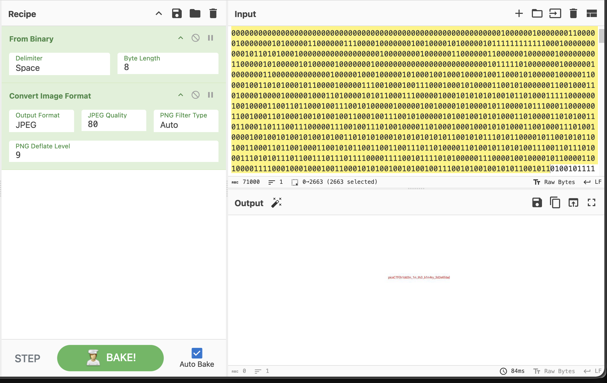

# Binary Digits — Forensics, Easy (picoCTF 2026)

- **Competition:** picoCTF 2026
- **Category:** Forensics
- **Difficulty:** Easy
- **Author:** Yahaya Meddy

## Statement

This file doesn't look like much... just a bunch of 1s and 0s. But maybe it's not just random noise. Can you recover anything meaningful from this?

## Thought Process

The challenge gives us a `digits.bin` file.

1. Seems simple enough. We can decode binary into text to find meaning.
2. First we decode this raw binary into `ascii/utf-8` in CyberChef. We got a really long string of 1s and 0s.
3. Let's try decoding that string again. We get a sample of what looks like a binary blob, and the `JFIF` header in it means it's a JPG.
4. So we use [CyberChef](https://gchq.github.io/CyberChef) to convert from binary to a JPEG image.



Boom, flag in the image.

## Flag

```
picoCTF{h1d3n_1n_th3_b1n4ry_3d2e65ba}
```