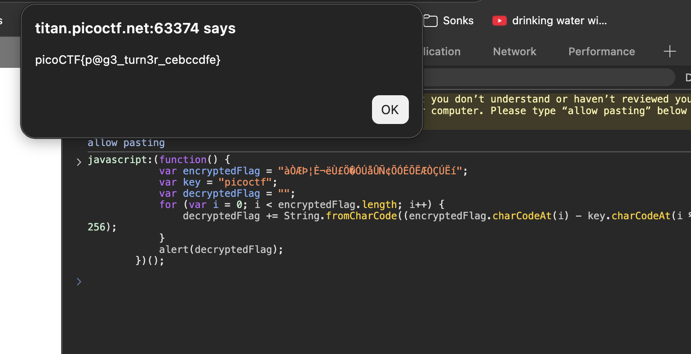

# Bookmarklet: Web Exploitation, Easy (picoCTF 2024)

- **Competition:** picoCTF 2024
- **Category:** Web Exploitation
- **Difficulty:** Easy
- **Author:** Jeffery John

## Statement

Why search for the flag when I can make a bookmarklet to print it for me?

## Thought Process

1. The page is this code:

```html
<!doctype html>
<html lang="en">

<head>
    <meta charset="utf-8">
    <meta name="viewport" content="width=device-width, initial-scale=1">
    <title>picoCTF - picoGym | Bookmarklet Challenge</title>
    <link rel="icon" type="image/png" sizes="32x32" href="/favicon-32x32.png">
    <style>
        body {
            font-family: "Lucida Console", Monaco, monospace;
        }

        h1,
        p {
            color: #000000;
        }
    </style>
    <!-- Sources: https://picoctf.org | https://undraw.co -->
</head>

<body class="picoctf{}" style="margin: 0">
    <div class="picoctf{}" style="margin: 0; padding: 0; background-color: #757575; display:auto; height:40%">
        <a class="picoctf{}" href="/"></a>
    </div>

    <center>
        <br class="picoctf{}">
        <br class="picoctf{}">
        <div class="picoctf{}"
            style="padding-top:30px; border-radius:3%; box-shadow: 0px 5px 10px #0000004d; width: 50%; align-self: center;">
            
            <div class="picoctf{}" style="width:85%">
                <h2 class="picoctf{}">Welcome to my flag distribution website!</h2>
                <div class="picoctf{}" style="width:70%">
                    <p class="picoctf{}">If you're reading this, your browser has succesfully received the flag.</p>
                    <p class="picoctf{}">Here's a bookmarklet for you to try:</p>

                    <textarea id="bookmarkletCode" rows="3" cols="45" style="color:#000000" readonly>
        javascript:(function() {
            var encryptedFlag = "àÒÆަȬë٣֖ÓÚåÛÑ¢ÕÓÉÕËÆÒÇÚËí";
            var key = "picoctf";
            var decryptedFlag = "";
            for (var i = 0; i < encryptedFlag.length; i++) {
                decryptedFlag += String.fromCharCode((encryptedFlag.charCodeAt(i) - key.charCodeAt(i % key.length) + 256) % 256);
            }
            alert(decryptedFlag);
        })();
    </textarea>

                    <div id="notice" style="display: none; color: green;">Code copied to clipboard!</div>

                    <script>
                        var codeTextArea = document.getElementById("bookmarkletCode");
                        var notice = document.getElementById("notice");

                        codeTextArea.addEventListener("click", function () {
                            codeTextArea.select();
                            document.execCommand("copy");
                            notice.style.display = "block";

                            setTimeout(function () {
                                notice.style.display = "none";
                            }, 2000);
                        });
                    </script>

                </div>
            </div>
            <br class="picoctf{}">
    </center>
</body>

</html>
```

2. I personally have no idea what a bookmarklet is.
3. The key part is the bookmarklet code sitting in that `<textarea>`:

```javascript
javascript:(function() {
    var encryptedFlag = "àÒÆަȬë٣֖ÓÚåÛÑ¢ÕÓÉÕËÆÒÇÚËí";
    var key = "picoctf";
    var decryptedFlag = "";
    for (var i = 0; i < encryptedFlag.length; i++) {
        decryptedFlag += String.fromCharCode((encryptedFlag.charCodeAt(i) - key.charCodeAt(i % key.length) + 256) % 256);
    }
    alert(decryptedFlag);
})();
```

4. Let's try pasting this into the console and see what happens.



5. Okay, it works I guess. The script decrypts the `encryptedFlag` string using `key` and pops the result in an alert. Boom, flag.

## Flag

```
picoCTF{p@g3_turn3r_cebccdfe}
```