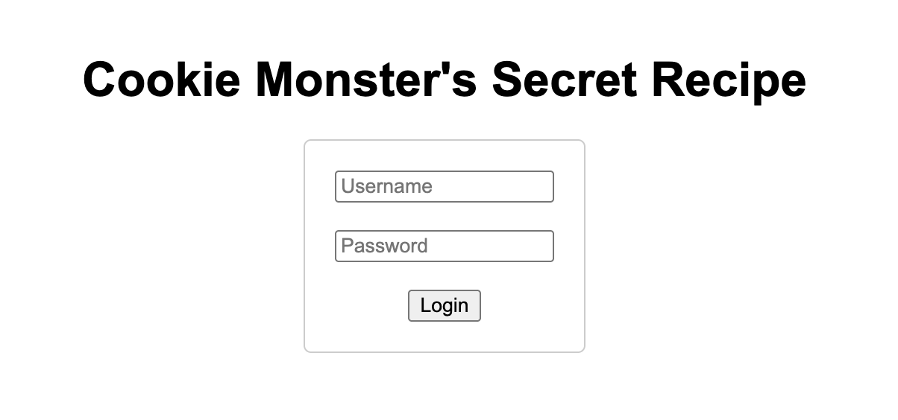
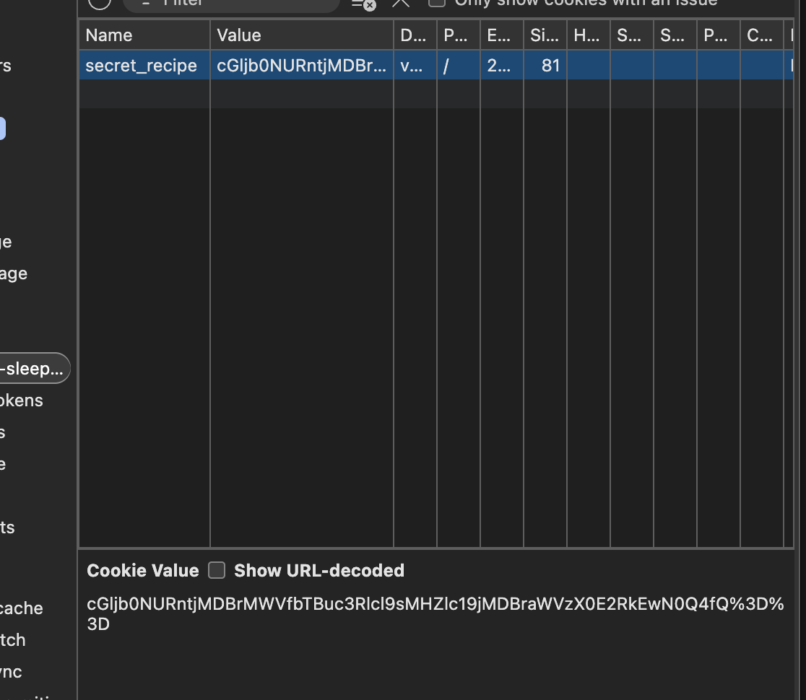
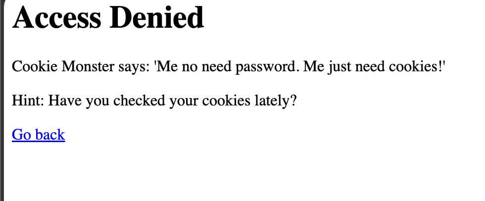
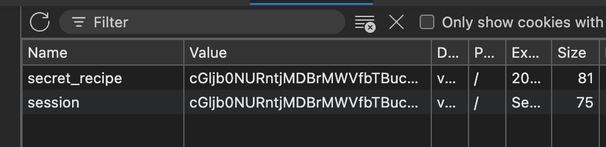
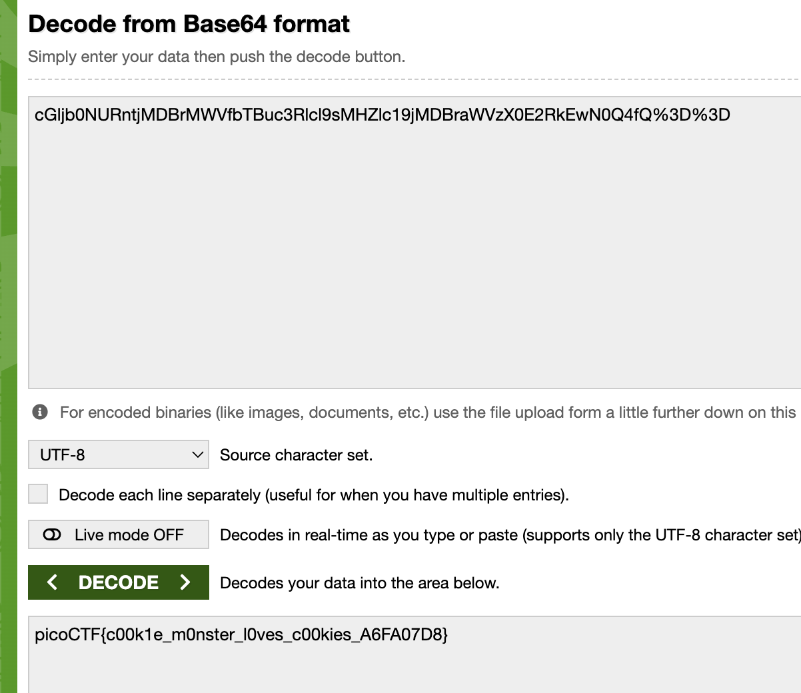

# Cookie Monster Secret Recipe — Web Exploitation, Easy (picoCTF 2025)

- **Competition:** picoCTF 2025
- **Category:** Web Exploitation
- **Difficulty:** Easy
- **Author:** Brhane Giday and Prince Niyonshuti N.

## Statement

Cookie Monster has hidden his top-secret cookie recipe somewhere on his website. As an aspiring cookie detective, your mission is to uncover this delectable secret. Can you outsmart Cookie Monster and find the hidden recipe?

## Thought Process



1. This is the initial page. Since the challenge name is all about cookies, and session/auth data lives in cookies the server sets, I immediately opened dev tools and checked the session cookies.



2. Right there there's a "secret recipient" cookie with a long value:

```
cGljb0NURntjMDBrMWVfbTBuc3Rlcl9sMHZlc19jMDBraWVzX0E2RkEwN0Q4fQ%3D%3D
```

That's the cookie. The `%3D%3D` at the end caught my eye — that's `==` URL-encoded, and `=` is base64 padding, so I suspected this was base64 hiding in a cookie.
3. Then I noticed something odd: any username and any password logs in.



I tried `bob`/`123`, then `jeff`/`246` — the exact same page either way. This tells me the server isn't validating credentials at all, so the real secret isn't guarded by the login — it has to be carried in that cookie instead.
4. Next I tried creating a new cookie named `session` with that value. It didn't work.



That makes sense looking back — the server only reads the cookie under its actual name (`secret recipient`), so a cookie under the wrong name is simply ignored.
5. At first I thought it was something complicated, but I remembered the `%3D` ending and considered base64. I put the cookie value into a base64 decoder and viola:



Boom flag.

## Flag

```
picoCTF{c00k1e_m0nster_l0ves_c00kies_A6FA07D8}
```