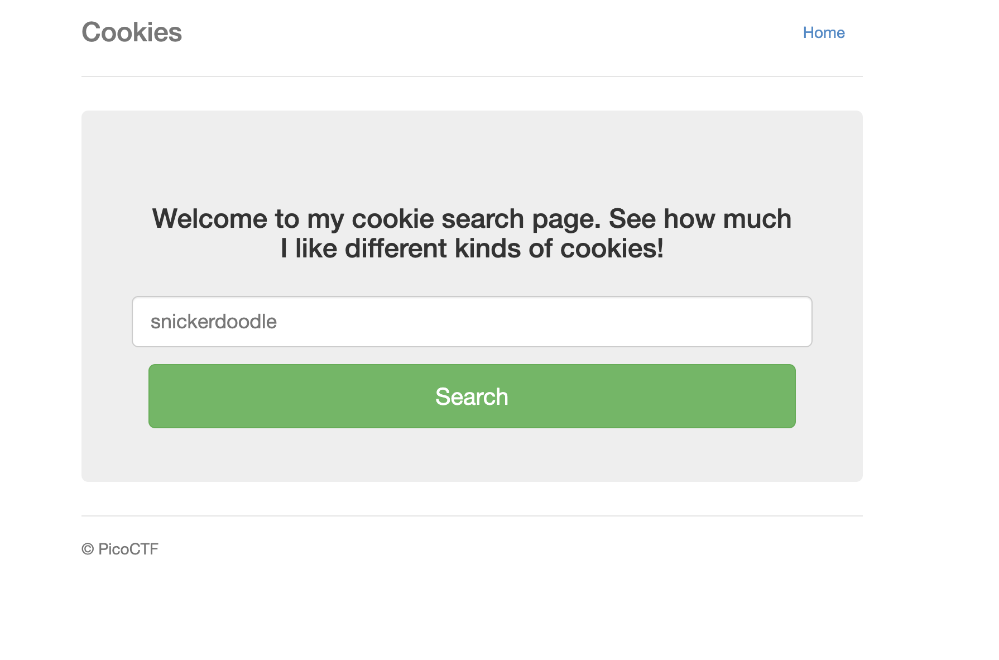
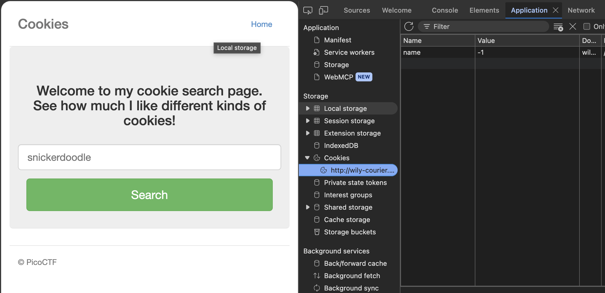
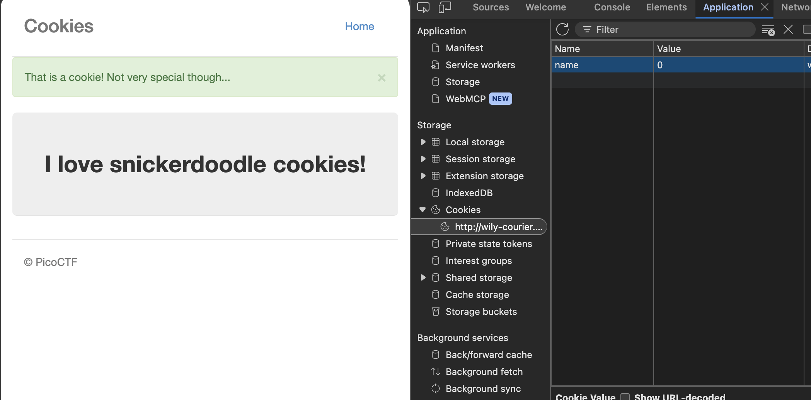
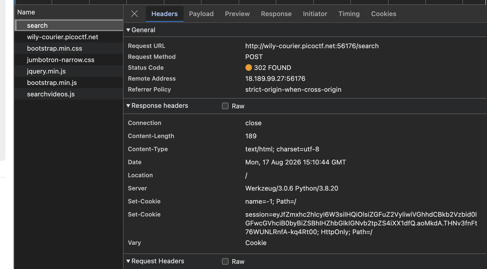
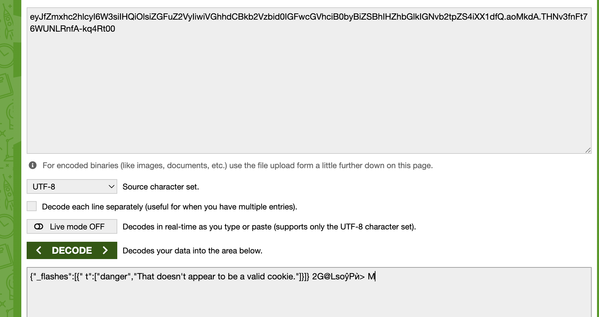
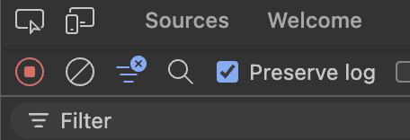
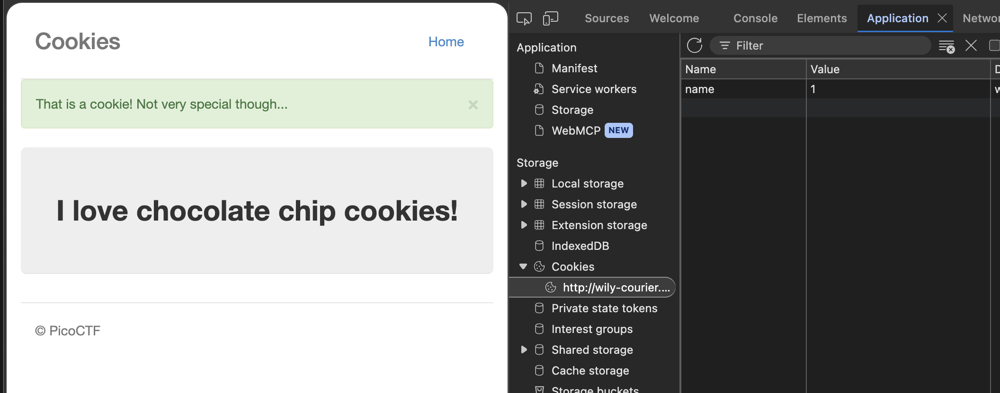

# Cookies: Web Exploitation, Easy (picoCTF 2021)

- **Competition:** picoCTF 2021
- **Category:** Web Exploitation
- **Difficulty:** Easy
- **Author:** madStacks

## Statement

Who doesn't love cookies? Try to figure out the best one.

## Thought Process



1. This is the page. Since this CTF is about cookies, let's immediately open up the developer tools and check the cookie storage.



2. Typing snickerdoodle shows this:



3. Wasn't able to capture it, but every time I click the search button a session cookie opens up for a split second. Let's try to capture that cookie and maybe decode it.
4. How do I capture something that flashes for a split second? Maybe Burp Suite could do it, but I don't know how to use that yet. Let's try the Network tab instead.
5. There's a request to `/search`, and it shows a `Set-Cookie` header with a cookie in it.



6. Let's try decoding that session cookie value:

```
eyJfZmxhc2hlcyI6W3siIHQiOlsiZGFuZ2VyIiwiVGhhdCBkb2Vzbid0IGFwcGVhciB0byBiZSBhIHZhbGlkIGNvb2tpZS4iXX1dfQ.aoMkdA.THNv3fnFt76WUNLRnfA-kq4Rt00
```

It's a Flask session cookie, so I decoded the base64 payload part. The result:

```json
{"_flashes":[{" t":["danger","That doesn't appear to be a valid cookie."]}]}
```



7. Ah, this makes sense now. I tested it on a random name and not the successful snickerdoodle. Maybe using snickerdoodle would result in a decoded response that has the flag.
8. I had issues because it loaded a new page and wiped the network log. So I ticked and enabled the "Preserve log" option in the network tab.



9. Okay, no luck. It seems a successful cookie doesn't have a `Set-Cookie` header in it.
10. I tried something new: changing the `name` cookie value directly to 1. It resulted in the page saying "I love chocolate chip cookies".



11. Seems like the issue was me overcomplicating things. I just had to increment the value of the `name` cookie. Let's keep incrementing and see.

| Value | Cookie |
|-------|--------|
| -1    | login |
| 0     | snickerdoodle |
| 1     | chocolate chip |
| 2     | oatmeal raisin |
| 3     | gingersnap |
| 4     | shortbread |
| 5     | peanut butter |
| 6     | whoopiepie |
| 7     | sugar |
| 8     | molasses |
| 9     | kiss |
| 10    | biscotti |
| 11    | butter |
| 12    | spritz |
| 13    | snowball |
| 14    | drop |
| 15    | thumbprint |
| 16    | pinwheel |
| 17    | wafer |
| 18    | flag found |

12. Okay, this got a bit long. This took way too long, and I was lowkey about to program some curl thing that incremented until it matched a regex flag in the returned HTML, lmao. Anyways, we're done.

## Flag

```
picoCTF{3v3ry1_l0v3s_c00k135_a4dadb49}
```