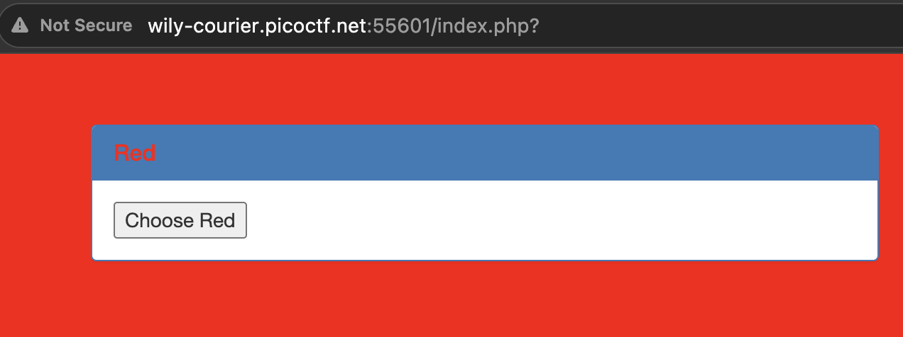
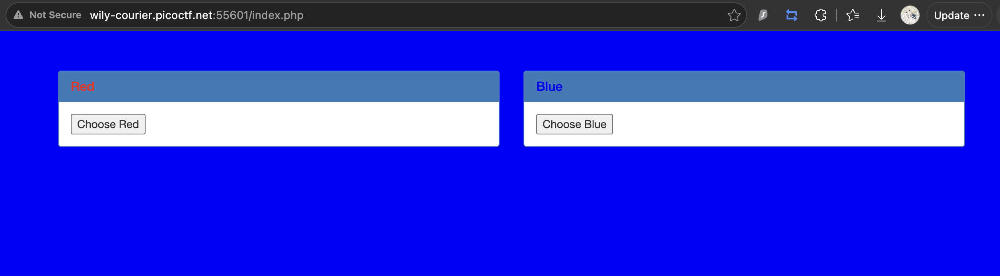

# GET aHEAD: Web Exploitation, Easy (picoCTF 2021)

- **Competition:** picoCTF 2021
- **Category:** Web Exploitation
- **Difficulty:** Easy
- **Author:** madStacks

## Statement

Find the flag being held on this server to get ahead of the competition.

## Thought Process


1. This is the page.
2. Clicking "Choose Red" turns the page red, and `index.php` now has a `?` on it. I'm assuming this can be used to put in arguments.



3. Clicking "Choose Blue" turns the page blue and shows `index.php` with no question mark.



4. There was a slight bug with my setup and I mislooked into cookies. It had a cookie name with value 18, seems to be carried over from [[Cookies]]. We will ignore the cookies.
5. The only change in the HTML is this block when clicking red or blue:

```html
<style>body {background-color: blue;}</style>
<style>body {background-color: red;}</style>
```

6. This means the value in the input of the "Choose Red" and "Choose Blue" forms could either be directly checked on `index.php` using if statements, or the value is parsed to take the second word. That possibly means we could do some injection. Let's test by changing the value in that form to something else and submitting.
7. Scratch that. Changing elements doesn't make the value posted change. But it seems like we could do some injecting.
8. Okay, once again I have overthought things. Red is just a button that GETs the PHP and Blue is a POST button. It determines the color based on the request type.
9. And given the name of the challenge, GET aHEAD, we should try with an HTTP HEAD request. Let's try curl:

```bash
curl -I -i http://wily-courier.picoctf.net:55601/index.php
```

Boom, flag in the head.

```
HTTP/1.1 200 OK
Date: Tue, 18 Aug 2026 11:09:45 GMT
Server: Apache/2.4.38 (Debian)
X-Powered-By: PHP/7.2.34
flag: picoCTF{r3j3ct_th3_du4l1ty_8b13f07}
Content-Type: text/html; charset=UTF-8
```

## Flag

```
picoCTF{r3j3ct_th3_du4l1ty_8b13f07}
```