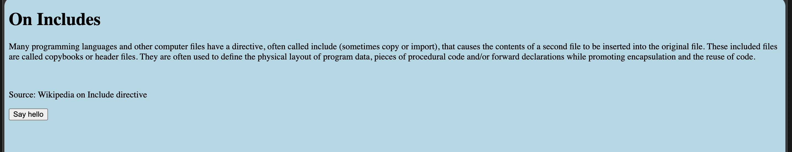
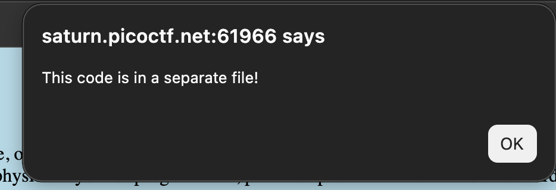
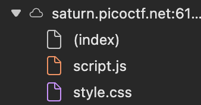

# Includes: Web Exploitation, Easy (picoCTF 2022)

- **Competition:** picoCTF 2022
- **Category:** Web Exploitation
- **Difficulty:** Easy
- **Author:** LT 'syreal' Jones

## Statement

Can you get the flag?

## Thought Process



1. Initial page. Clicking "Say hello" shows:



2. Now we check the developer tools. Given that the page mentions a script in a separate file, let's look for a separate script source.



Boom.
3. `script.js` shows this:

```javascript
function greetings()
{
  alert("This code is in a separate file!");
}

//  f7w_2of2_6edef411}
```

Seems like the second half of a CTF flag. Maybe the first half is in the CSS file.
4. `style.css` shows this:

```css
body {
  background-color: lightblue;
}

/*  picoCTF{1nclu51v17y_1of2_  */
```

Yep. Let's combine the two halves to boom, get the flag.

## Flag

```
picoCTF{1nclu51v17y_1of2_f7w_2of2_6edef411}
```