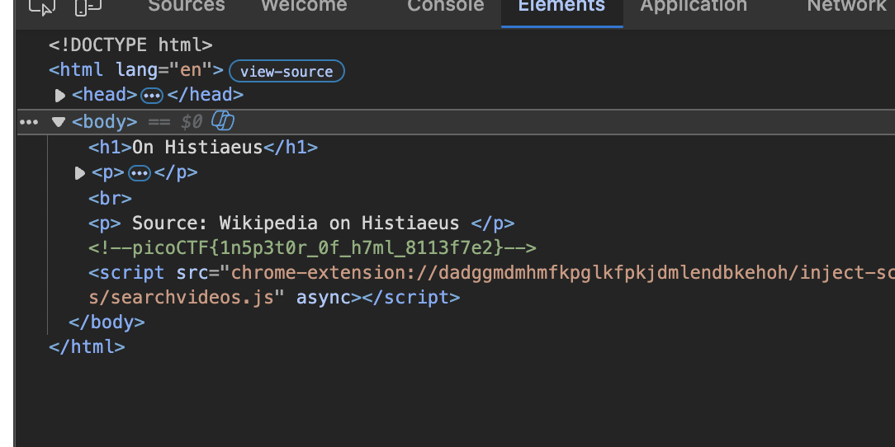

# Inspect HTML — Web Exploitation, Easy (picoCTF 2022)

- **Competition:** picoCTF 2022
- **Category:** Web Exploitation
- **Difficulty:** Easy
- **Author:** LT 'syreal' Jones

## Statement

Can you get the flag?

## Thought Process

It's right here — just inspect the page source.



The flag is sitting plaintext in the HTML source code.

## Flag

```
picoCTF{1n5p3t0r_0f_h7ml_8113f7e2}
```