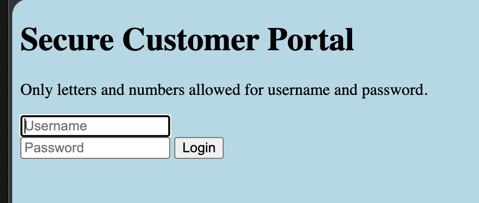
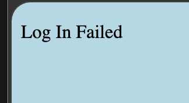
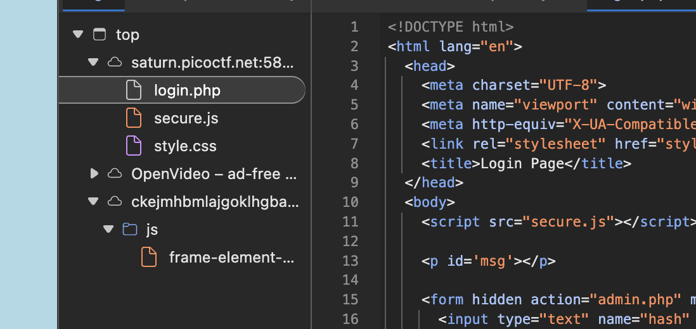

# Local Authority: Web Exploitation, Easy (picoCTF 2022)

- **Competition:** picoCTF 2022
- **Category:** Web Exploitation
- **Difficulty:** Easy
- **Author:** LT 'syreal' Jones

## Statement

Can you get the flag?

## Thought Process



1. Page immediately. I just try username `bob`, password `123` and I get:



2. Let's check dev tools now. It's just a simple HTML page:

```html
<!DOCTYPE html>
<html lang="en">
  <head>
    <meta charset="UTF-8">
    <meta name="viewport" content="width=device-width, initial-scale=1.0">
    <meta http-equiv="X-UA-Compatible" content="ie=edge">
    <link rel="stylesheet" href="style.css">
    <title>Secure Customer Portal</title>
  </head>
  <body>

    <h1>Secure Customer Portal</h1>
    
   <p>Only letters and numbers allowed for username and password.</p>
    
    <form role="form" action="login.php" method="post">
      <input type="text" name="username" placeholder="Username" required 
       autofocus></br>
      <input type="password" name="password" placeholder="Password" required>
      <button type="submit" name="login">Login</button>
    </form>
  </body>
</html>
```

Seems like it's just a form, no frontend JS script. It posts a request to `login.php`.
3. Upon typing in `bob` and `123` again we check the login failed page, and in the sources it returns the `/login.php` HTML:

```html
<html lang="en">
  <head>
    <meta charset="UTF-8">
    <meta name="viewport" content="width=device-width, initial-scale=1.0">
    <meta http-equiv="X-UA-Compatible" content="ie=edge">
    <link rel="stylesheet" href="style.css">
    <title>Login Page</title>
  </head>
  <body>
    <script src="secure.js"></script>
    
    <p id='msg'></p>
    
    <form hidden action="admin.php" method="post" id="hiddenAdminForm">
      <input type="text" name="hash" required id="adminFormHash">
    </form>
    
    <script type="text/javascript">
      function filter(string) {
        filterPassed = true;
        for (let i =0; i < string.length; i++){
          cc = string.charCodeAt(i);
          
          if ( (cc >= 48 && cc <= 57) ||
               (cc >= 65 && cc <= 90) ||
               (cc >= 97 && cc <= 122) )
          {
            filterPassed = true;     
          }
          else
          {
            return false;
          }
        }
        
        return true;
      }
    
      window.username = "bob";
      window.password = "123";
      
      usernameFilterPassed = filter(window.username);
      passwordFilterPassed = filter(window.password);
      
      if ( usernameFilterPassed && passwordFilterPassed ) {
      
        loggedIn = checkPassword(window.username, window.password);
        
        if(loggedIn)
        {
          document.getElementById('msg').innerHTML = "Log In Successful";
          document.getElementById('adminFormHash').value = "2196812e91c29df34f5e217cfd639881";
          document.getElementById('hiddenAdminForm').submit();
        }
        else
        {
          document.getElementById('msg').innerHTML = "Log In Failed";
        }
      }
      else {
        document.getElementById('msg').innerHTML = "Illegal character in username or password."
      }
    </script>
    
  </body>
</html>
```

4. We can see that to get "Log In Successful" we have to pass the `checkPassword` check. If it returns true, the hidden admin form gets submitted.
5. Now let's try to find where `checkPassword` is defined. There's no raw JS function for it in this script block, but if we check the sources:



6. We can see a `secure.js`. Let's check that. Boom, it's inside there:

```javascript
function checkPassword(username, password)
{
  if( username === 'admin' && password === 'strongPassword098765' )
  {
    return true;
  }
  else
  {
    return false;
  }
}
```

Just a simple hardcoded admin credential stored in an if condition as a string. Let's use that.
7. Login successful and we get the flag.

## Flag

```
picoCTF{j5_15_7r4n5p4r3n7_a8788e61}
```