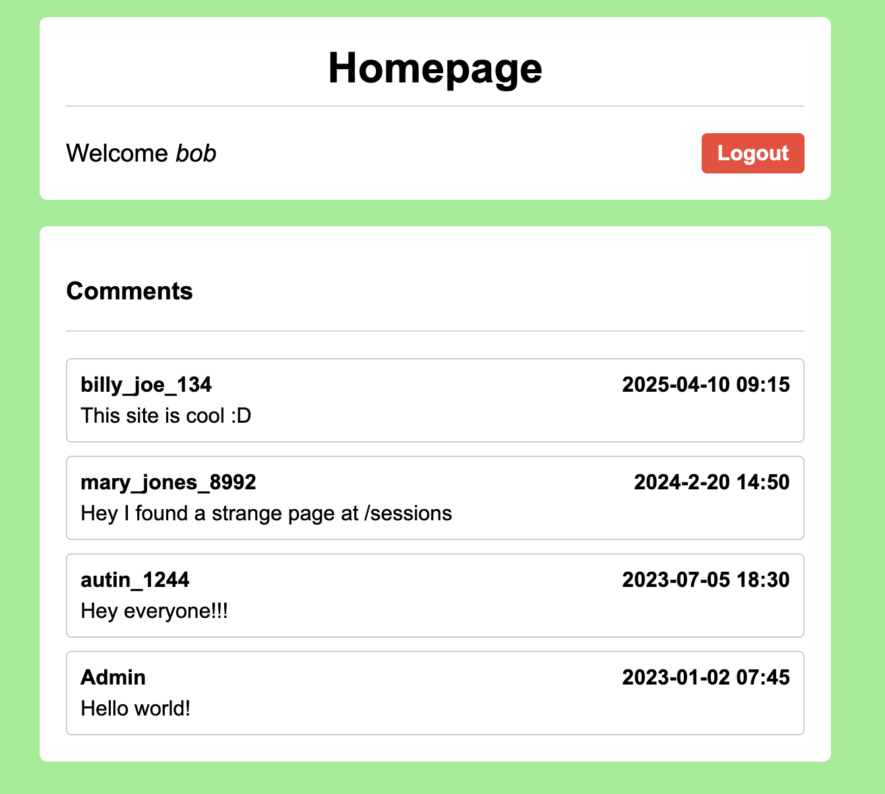
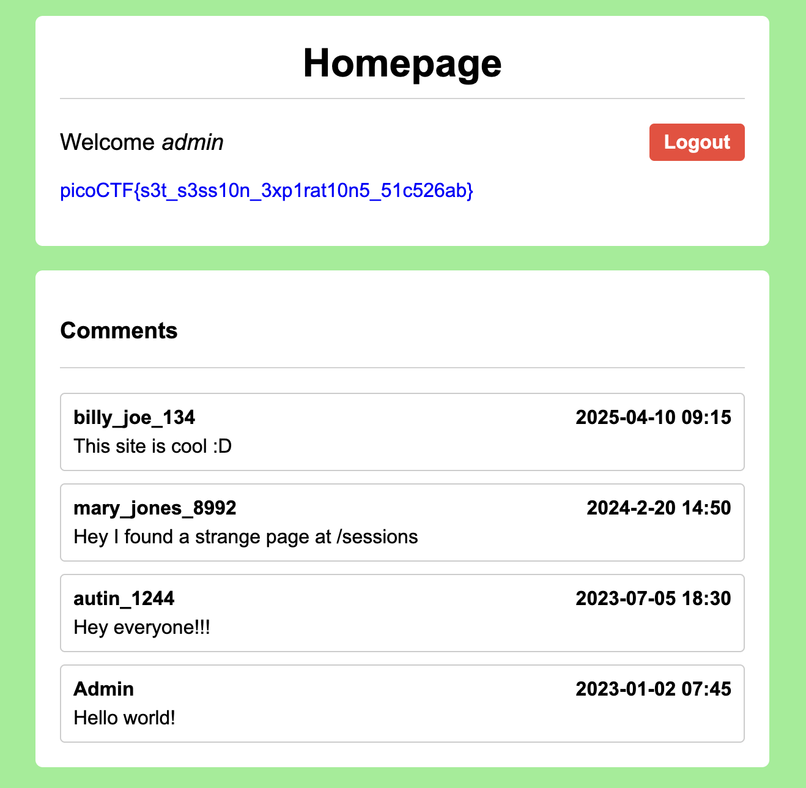

# Old Sessions — Web Exploitation, Easy (picoCTF 2026)

- **Competition:** picoCTF 2026
- **Category:** Web Exploitation
- **Difficulty:** Easy
- **Author:** David Gaviria

## Statement

Proper session timeout controls are critical for securing user accounts. If a user logs in on a public or shared computer but doesn't explicitly log out (instead simply closing the browser tab), and session expiration dates are misconfigured, the session may remain active indefinitely.

This then allows an attacker using the same browser later to access the user's account without needing credentials, exploiting the fact that sessions never expire and remain authenticated.

Your friend tells you to check out a new social media platform he built a few years ago. Although it's still under development, he said the site is almost complete. He also mentioned that he hates constantly logging into sites, and so has made his page so that "once you login, you never have to log-out again"!

Starting gives you a URL to test: <http://dolphin-cove.picoctf.net/>

## Thought Process


- Right off the bat I knew this had something to do with cookies. Most authentication systems nowadays have stuff to do with cookies.
- I made an account, logged in, and checked my cookies.



- Right away, when logged in, there's a comment on the site that mentions the suspicious `/sessions` page.
- The `/sessions` page result is just raw text, shown below:

```
1) session:fOvy_ZcKddxbLUSLKwt8rFhJvBJcBEqN5ihY4EvSxCs, {'_permanent': True, 'key': 'admin'}

2) session:S1D2qCSOnpLVrIGMUTM9YaIzIalehUYw-HBFkJlT8LA, {'_permanent': True, 'key': 'bob'}
```

- Went in and saw the session cookies. There's one cookie that relates to the admin.
- Went back to the logged-in page, went into developer tools, and replaced the session cookie value with the admin one.



- Got the flag.

## Flag

```
picoCTF{s3t_s3ss10n_3xp1rat10n5_51c526ab}
```
