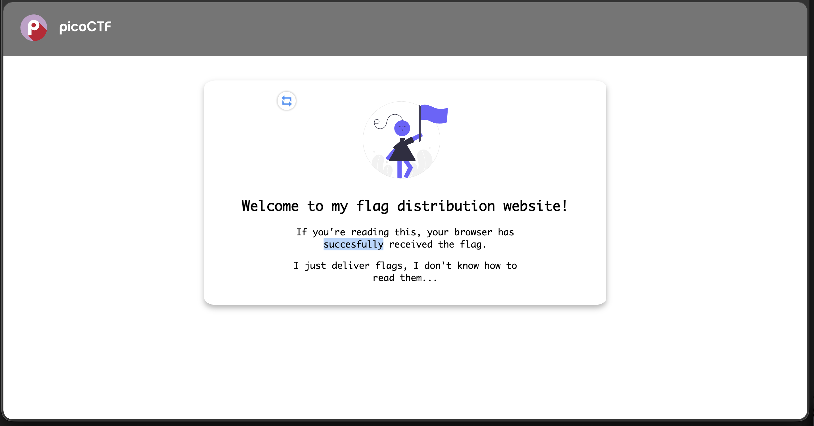
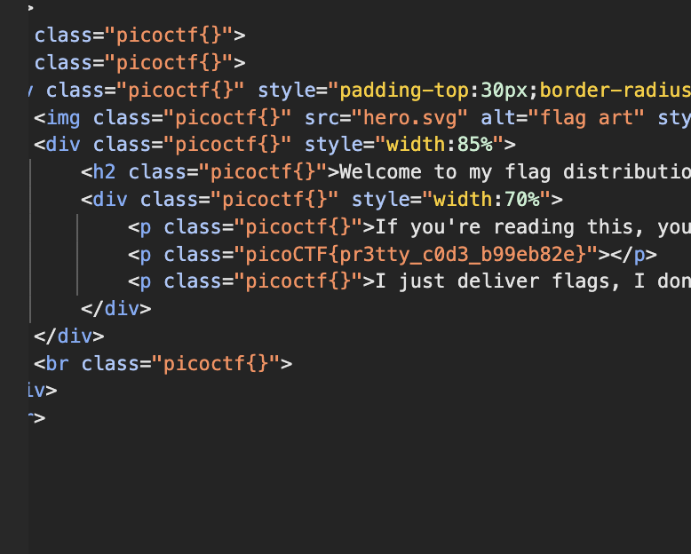

# Unminify: Web Exploitation, Easy (picoCTF 2024)

- **Competition:** picoCTF 2024
- **Category:** Web Exploitation
- **Difficulty:** Easy
- **Author:** Jeffery John

## Statement

I don't like scrolling down to read the code of my website, so I've squished it. As a bonus, my pages load faster!

## Thought Process



1. This is the page we see when we enter.
2. The statement says the code is squished, meaning minified. Let's inspect the element.
3. I go to the Sources tab and see the full unminified HTML file that is delivered. That's easier than manually expanding every collapsed section in the Elements tab, and the flag is right there.



Boom.

## Flag

```
picoCTF{pr3tty_c0d3_b99eb82e}
```