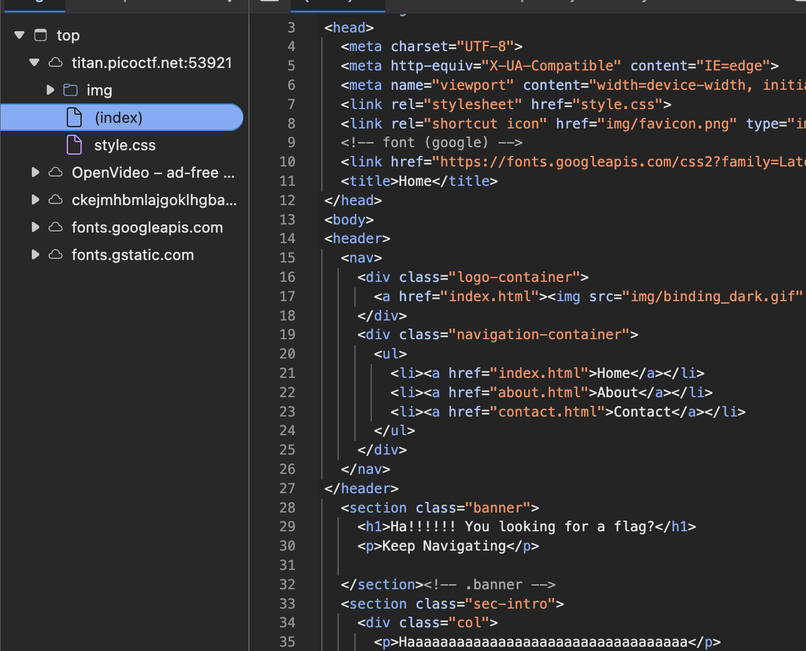
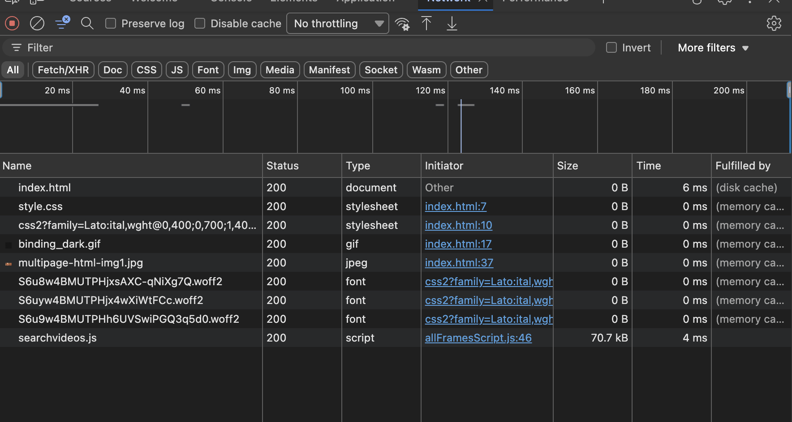
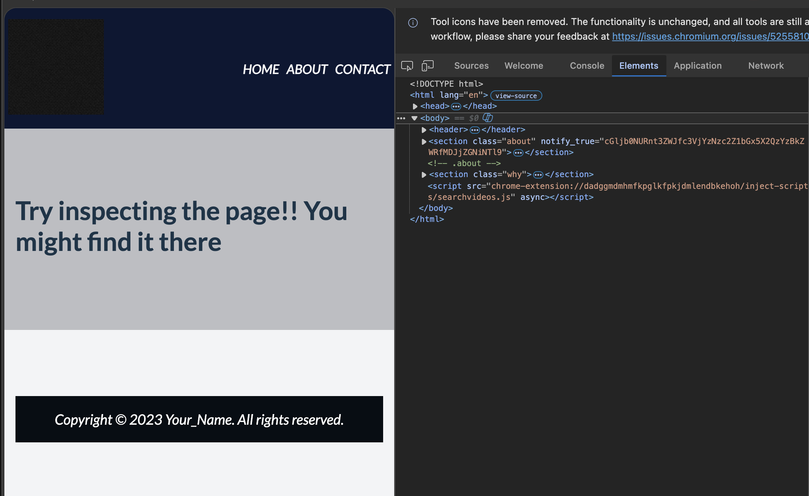
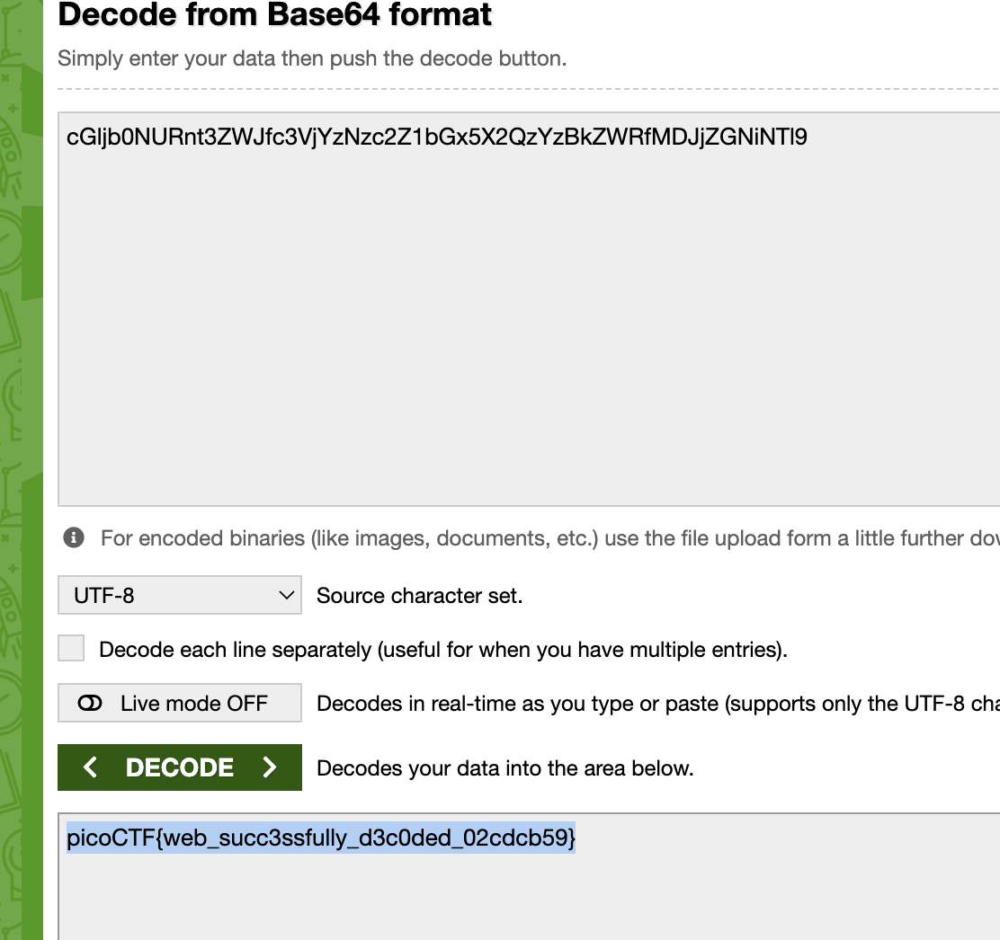

# WebDecode: Web Exploitation, Easy (picoCTF 2024)

- **Competition:** picoCTF 2024
- **Category:** Web Exploitation
- **Difficulty:** Easy
- **Author:** Nana Ama Atombo-Sackey

## Statement

Do you know how to use the web inspector?

## Thought Process


1. Opening the page you see this. Since it talks about the web inspector, let's open inspect element.
2. The Elements tab shows nothing, let's move on.



3. The CSS file is nothing too.
4. The Network tab seems promising.



5. I originally intended to decode the woff2 files from base64, but I noticed there's a navbar that I can click, so let's check that first.
6. I navigate to the About section and inspect the element.



7. A `notify_true` attribute on the element has this value:

```
cGljb0NURnt3ZWJfc3VjYzNzc2Z1bGx5X2QzYzBkZWRfMDJjZGNiNTl9
```

That's a base64-looking string, so let's try decoding it.
8. Boom flag.



## Flag

```
picoCTF{web_succ3ssfully_d3c0ded_02cdcb59}
```