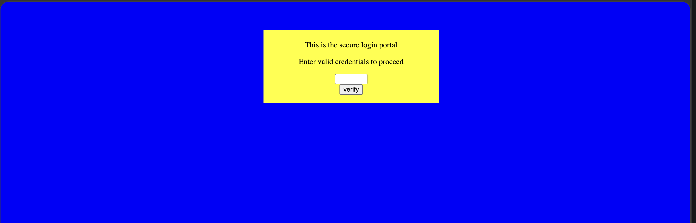
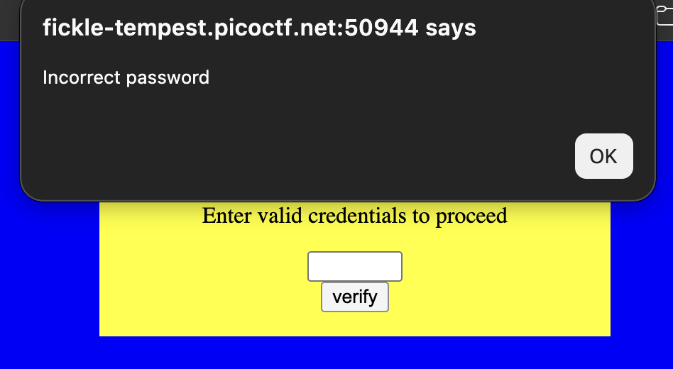

# dont-use-client-side: Web Exploitation, Easy (picoCTF 2019)

- **Competition:** picoCTF 2019
- **Category:** Web Exploitation
- **Difficulty:** Easy
- **Author:** Alex Fulton/Danny

## Statement

Can you break into this super secure portal?

## Thought Process



1. This is the page. Eww.
2. Let's try clicking verify with nothing first.



3. "Incorrect password" it seems. Let's try typing something in just in case. Same result.
4. Let's move on to the developer tools and check the elements for anything suspicious. Right away we have an obvious suspicious script section:

```html
<script type="text/javascript">
  function verify() {
    checkpass = document.getElementById("pass").value;
    split = 4;
    if (checkpass.substring(0, split) == 'pico') {
      if (checkpass.substring(split*6, split*7) == 'eb02') {
        if (checkpass.substring(split, split*2) == 'CTF{') {
         if (checkpass.substring(split*4, split*5) == 'ts_p') {
          if (checkpass.substring(split*3, split*4) == 'lien') {
            if (checkpass.substring(split*5, split*6) == 'lz_2') {
              if (checkpass.substring(split*2, split*3) == 'no_c') {
                if (checkpass.substring(split*7, split*8) == 'b45}') {
                  alert("Password Verified")
                  }
                }
              }
      
            }
          }
        }
      }
    }
    else {
      alert("Incorrect password");
    }
    
  }
</script>
```

5. The password check happens entirely in this client-side script, with `split = 4`, so every check tests a 4-character chunk of the password. Each `substring(a, b)` tells us which chunk must sit at that offset. Ordering the chunks by their start position:

| Position | Chars  | Required |
|----------|--------|----------|
| 0        | 0-3    | `pico`   |
| 4        | 4-7    | `CTF{`   |
| 8        | 8-11   | `no_c`   |
| 12       | 12-15  | `lien`   |
| 16       | 16-19  | `ts_p`   |
| 20       | 20-23  | `lz_2`   |
| 24       | 24-27  | `eb02`   |
| 28       | 28-31  | `b45}`   |

6. So we just piece the string together by start order:

```
pico + CTF{ + no_c + lien + ts_p + lz_2 + eb02 + b45}
```

## Flag

```
picoCTF{no_clients_plz_2eb02b45}
```