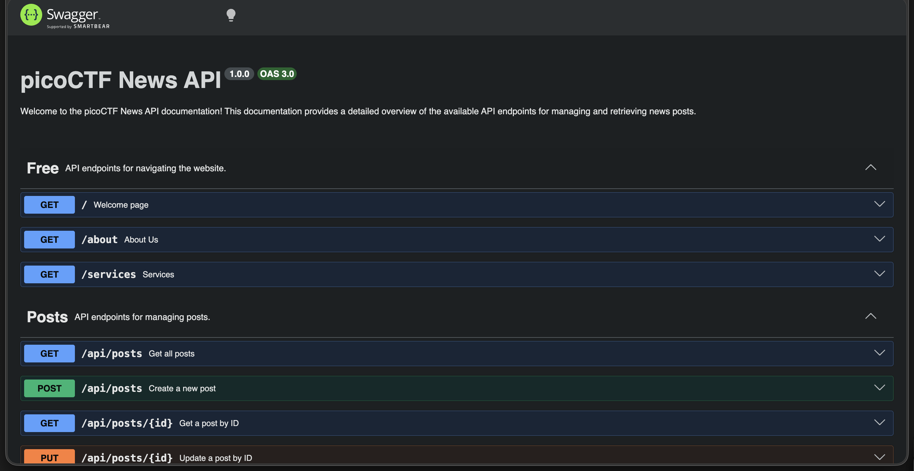
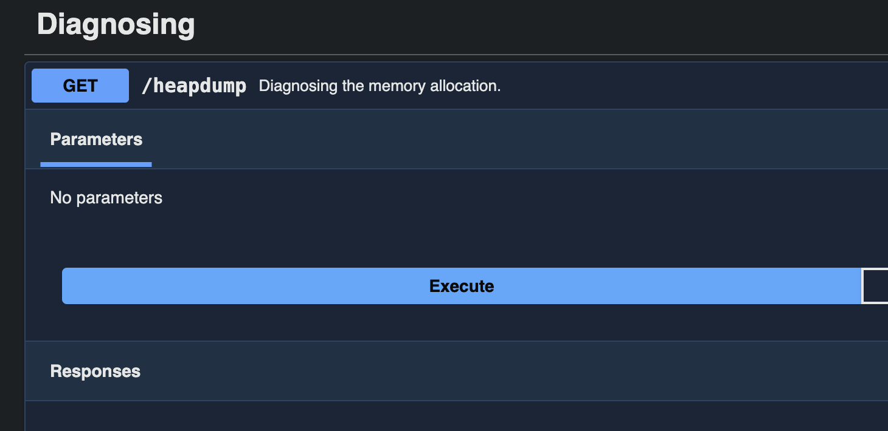
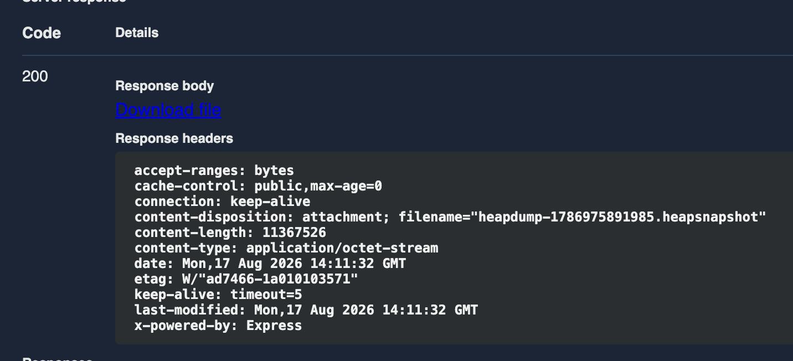
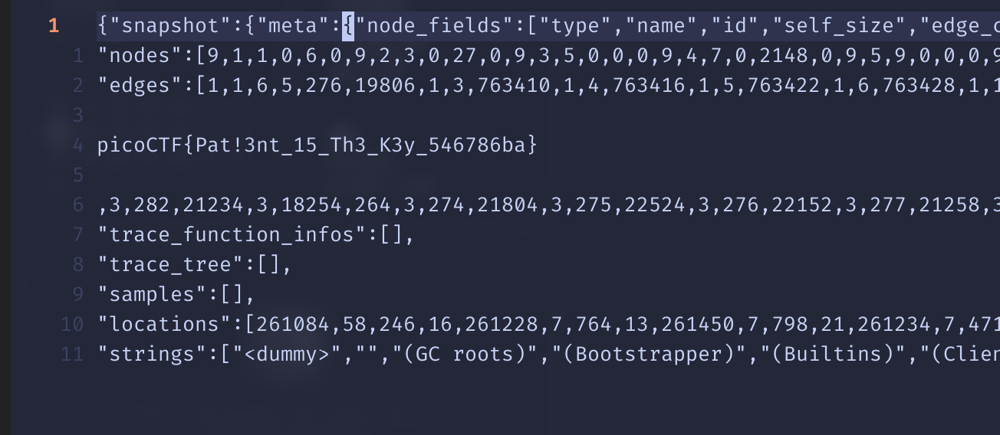

# head-dump — Web Exploitation, Easy (picoCTF 2025)

- **Competition:** picoCTF 2025
- **Category:** Web Exploitation
- **Difficulty:** Easy
- **Author:** Prince Niyonshuti N.

## Statement

Welcome to the challenge! In this challenge, you will explore a web application and find an endpoint that exposes a file containing a hidden flag.

The application is a simple blog website where you can read articles about various topics, including an article about API Documentation. Your goal is to explore the application and find the endpoint that generates files holding the server's memory, where a secret flag is hidden.

## Thought Process


1. Upon opening it, this is the website you see — a blog.
2. Upon clicking the `API-Documentation` hashtag, it opens up a page with API endpoints.



3. Scrolling down we see a "Diagnosing" section, which talks about `/heapdump`. That caught my attention — the statement said the flag is hidden in a file that holds the server's memory, and a heap dump is literally a snapshot of the process's memory, which is where secrets like flags end up.



4. Clicking "try it out" we get a successful response:



5. Now I try using `cat` on the heapdump, but it seems like it's too large to easily browse through — heap dumps are giant JSON blobs of every object in memory, so grepping by eye is useless.
6. I now try opening it in vim, and I can see the flag right there because vim handles the lines properly.



Boom, flag.

## Flag

```
picoCTF{Pat!3nt_15_Th3_K3y_546786ba}
```