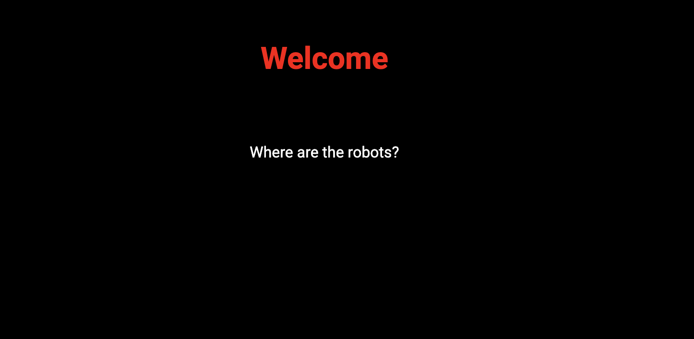

# Where Are the Robots: Web Exploitation, Easy (picoCTF 2019)

- **Competition:** picoCTF 2019
- **Category:** Web Exploitation
- **Difficulty:** Easy
- **Author:** zaratec/Danny

## Statement

Can you find the robots?

## Thought Process



1. The home page is a blank page.
2. Back to dev tools. The HTML, JS, and `styles.css` show nothing suspicious.
3. I assume this is a reference to `robots.txt`, the file used to manage web crawler traffic. Let's try using `/robots.txt` in the URL.

Response:

```
User-agent: *
Disallow: /cc6b1.html
```

4. The robots file disallows crawlers from `/cc6b1.html`, so that page is probably hiding something. Let's try it.


Boom, found.

## Flag

```
picoCTF{ca1cu1at1ng_Mach1n3s_cc6b1}
```